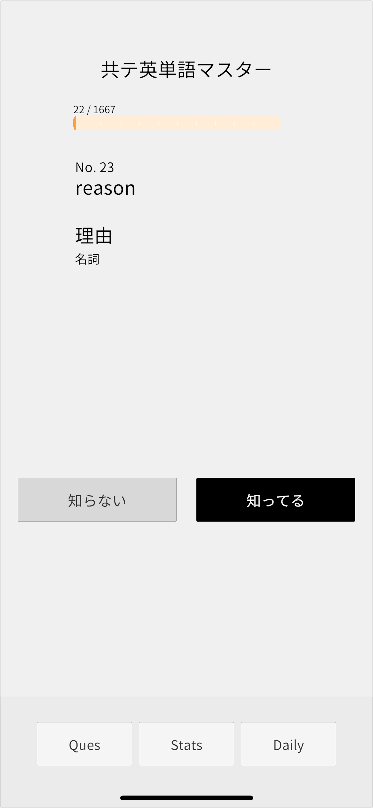
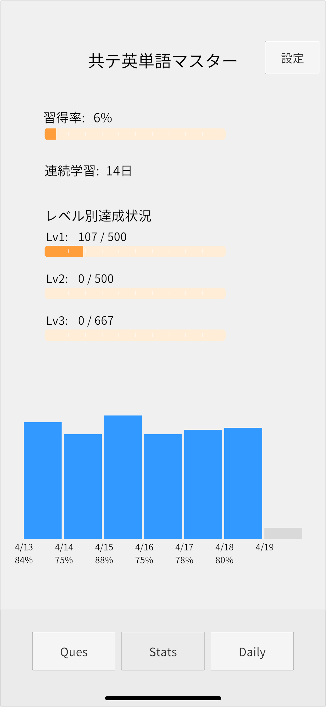
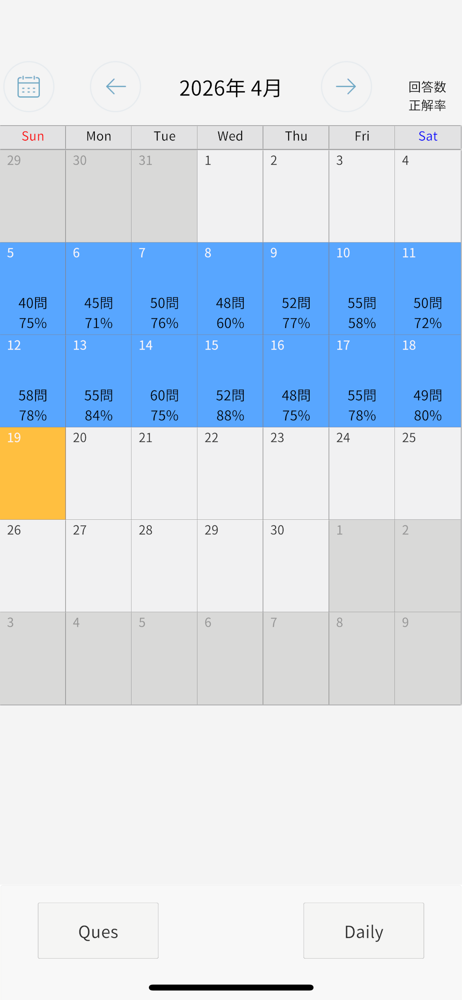

# 共テ英単語マスター

**忘却曲線 × 個別最適化で、共通テスト英単語を効率学習するiPhoneアプリ**

<p align="center">
  
  
  
</p>

---

## 🎯 このアプリについて

大学入学共通テスト対策として、**過去問6年分 × 単語帳10冊**のデータを突合して抽出した**1667語**を、エビングハウスの忘却曲線に基づく**個別最適化アルゴリズム**で復習できるiPhoneアプリです。

### なぜ作ったか

英単語帳を何周しても、模試で知らない単語が出る。調べてみると：

- **ターゲット（1200+1400+1900）全冊** → カバー率 **56%**
- **シス単（Basic+シス単）全冊** → カバー率 **71%**
- **どの単語帳にも載っていない共テ出題語** → **1,131語**

市販の単語帳を全部やっても、共通テストの単語を半分もカバーできていなかった。

そこで、10冊分のデータを統合した1667語のリストを作成し、さらに**最適なタイミングで復習できるアプリ**を開発しました。

---

## 🧮 独自アルゴリズム

### 記憶の数理モデル

```
memory = strength × e^(-k × t)
```

| 変数 | 意味 | 範囲 |
|---|---|---|
| strength | 記憶強度 | 0.1 〜 1.0 |
| k | 忘却係数（単語ごとに個別管理） | 0.01 〜 0.20 |
| t | 最後の復習からの経過時間 | - |

### 個別k値の更新

| 回答 | strength | k値 |
|---|---|---|
| わかる | +0.20 | × 0.95（忘れにくくなる） |
| わからない | −0.20 | × 1.10（忘れやすくなる） |

### 最適復習タイミング

```
t = -ln(0.5 / strength) / k
```

記憶が50%に低下するタイミングで復習を提示。同じ単語でも、ユーザーの回答パターンに応じて復習間隔が自動調整されます。

### 既存手法との違い

| | 共テ英単語マスター | 一般的な単語アプリ |
|---|---|---|
| 復習間隔 | 単語ごとに個別最適化 | 固定間隔（1日→3日→7日） |
| 忘れやすさ | k値で数値化・管理 | 考慮なし |
| 出題順 | 重要度順（共テ頻出順） | ランダム or 順番 |
| 対象語彙 | 過去問から抽出した1667語 | 出版社の選定基準 |

---

## ⚙️ 技術構成

```
iPhone (Unity / C#)
    ↓ HTTPS
PHP API (REST)
    ↓ PDO
MySQL 8.0
```

### 主要コンポーネント

| ファイル | 役割 |
|---|---|
| `StudyManager.cs` | 出題ロジック・回答処理・忘却曲線計算 |
| `StatsManager.cs` | 習得率・連続日数・レベル別達成・週間グラフ |
| `DailyManager.cs` | 月別カレンダー表示 |
| `SyncManager.cs` | オフライン同期（未送信キュー管理） |
| `ApiManager.cs` | サーバー通信管理 |
| `CsvLoader.cs` | 単語データ読込 |
| `UserManager.cs` | ユーザー識別管理 |
| `SettingsManager.cs` | 設定画面・アカウント削除 |
| `UIManager.cs` | 画面切替管理 |

### データベース設計

```
users (ユーザー管理)
  └─ user_questions (学習記録: strength, k値, 復習回数)
       └─ review_logs (回答ログ: before/after の strength, k値)
questions (1667語の単語データ)
```

### オフライン対応

```
回答 → ローカル保存（即座）→ サーバー送信を試行
  ├─ 成功 → 完了
  └─ 失敗 → キューに蓄積 → ネット復帰時に自動同期
```

---

## 📱 機能一覧

### 学習画面（Ques）
- 重要度順に新規単語を出題
- 復習対象は最適タイミングで自動出題
- 復習70% / 新規30%のランダム配分
- 「答えを見る」→「わかる」/「わからない」の2ステップ

### 統計画面（Stats）
- 習得率（strength ≥ 0.8 かつ正解2回以上）
- 連続学習日数
- レベル別（Lv1/Lv2/Lv3）達成率
- 直近7日間の正答率グラフ

### カレンダー画面（Daily）
- 月別カレンダーで学習履歴を表示
- 日ごとの回答数・正答率
- 前月/次月/今月ボタンで移動

### 設定画面
- アカウント削除（App Store要件準拠）
- プライバシーポリシー
- 利用規約

---

## 📊 検証

（検証データ収集後に追記予定）

---

## 🔗 リンク

- 📱 [App Store](https://apps.apple.com/jp/app/共テ英単語マスター/id6762442043) 
- 🌐 [公式サイト](https://syncnode.jp/loopwords)
- 📝 [開発ストーリー（note）](https://note.com/xxxxx) （準備中）
---

## 開発者

- 長野県の公立高校 3年
- 情報オリンピック 1次予選突破
- GitHub: [@syuya-nakagawa](https://github.com/syuya-nakagawa)
---

© 2026 SyncNode. All rights reserved.
このリポジトリのコードは学習・研究目的で公開しています。無断での商用利用・再配布を禁じます。
